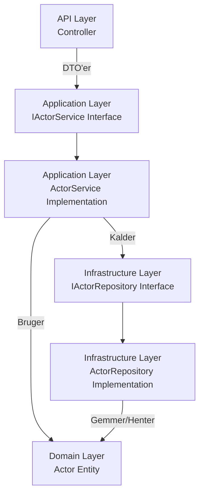

# <h2 id="services">⚙️ Services</h2>
#### Applications-laget indeholder forretningslogikken.
Application-laget beskriver hvad applikationen kan gøre, uden at vide hvordan data bliver lagret (det håndteres i Infrastructure-laget via repositories).

IActorService er en kontrakt (interface), der siger "dette er, hvad man kan gøre med en skuespiller" (fx Create, Update, Delete, GetAll).

ActorService er den konkrete implementering, der bruger Domain-modeller og kalder repositories.

#### Adskiller controller fra implementeringsdetaljer.
API-controller kalder kun IActorService – ikke ActorService direkte

#### Den følger Clean Architecture principperne
Her vises flowet i mellem lagene fra Controller → Application → Domain/Infrastructure med interface og implementation:



#### Dependency injection og abstraktion

##### Feltet
`private readonly IGenericRepository<Actor> _repo;`
- private readonly:
    - private betyder, at kun ActorService kan tilgå _repo.
    - readonly betyder, at _repo kun kan tildeles én gang – typisk i konstruktøren – og ikke ændres senere.

- IGenericRepository<Actor>
    - Dette er et interface, som specificerer, hvad et repository kan gøre (CRUD for Actor), uden at ActorService ved, hvordan det er implementeret.
    - `<Actor>` betyder, at dette repository håndterer netop Actor-entiteter.

##### Konstruktøren
```csharp
public ActorService(IGenericRepository<Actor> repo)
{
    _repo = repo;
}
```
- Dependency Injection (DI):

    - ActorService får sin afhængighed (IGenericRepository<Actor>) injiceret udefra.
    - Det betyder, at ActorService ikke selv opretter new ActorRepository(), men blot får en færdig instans leveret.

- Fordele:
    - Løs kobling – ActorService afhænger kun af interfacet, ikke af en specifik implementering.
    - Testbarhed – du kan let erstatte IGenericRepository<Actor> med en mock i Unit Tests.
    - Fleksibilitet – du kan skifte implementering (fx fra InMemoryRepository til SqlRepository) uden at ændre ActorService.
