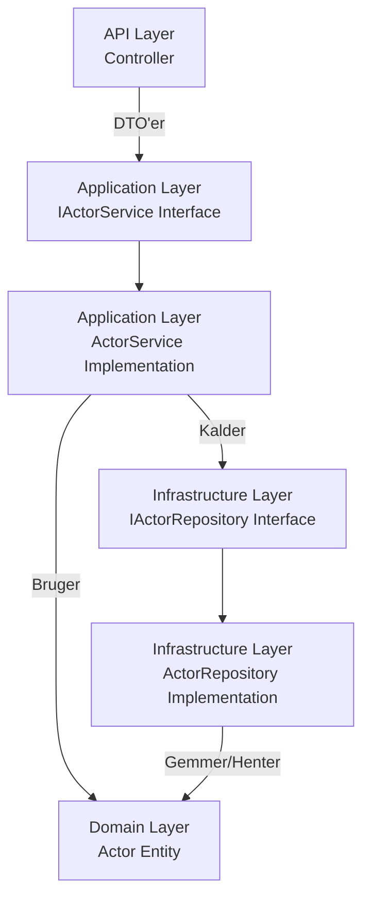

# Lagstruktur
### Lagene og deres ansvar

### 1. Api (præsentationslaget / WebAPI-projektet)
Det eneste lag der ved noget om HTTP og Web.  
Her hører følgende hjemme:

- ✅ **Controllers**
- ✅ **Filters** (f.eks. `ActionFilter`, `ExceptionFilter`)
- ✅ **Model binders**

👉 *Tænk på dette lag som et interface mod brugeren eller klienten.*

---

### 2. Domain (forretningslaget / core logic)
Hjertet af din applikation – *domænemodeller og regler*.  
Her hører følgende hjemme:

- ✅ **Entities / Models**
- ✅ **Value Objects**
- ✅ **Domain Services** (f.eks. regler der ikke naturligt hører til én entitet)
- ✅ **Enums**, **Exceptions**, **Business Rules**

💡 *Det skal være 100% uafhængigt af data/adgang og frameworks.*

---

### 3. Infrastructure-lag
Alt det, der har med lagring og dataadgang at gøre.  
Her hører følgende hjemme:

- ✅ **DbContext**
- ✅ **EF Core konfigurationer** (`OnModelCreating`, `EntityTypeConfiguration`)
- ✅ **Repository-implementeringer**
- ✅ **Migreringer** (valgfrit – kan også være i Api)
- ❌ **Ingen domænelogik eller DTO-håndtering**

---

### 4. Application-lag (ofte mellem Domain og Api)
Bruges typisk i Clean Architecture / DDD for at adskille *use cases* fra præsentation og domain.

- ✅ **Services** (som orchestration/brugsscenarier, fx `CreateOrderService`)
- ✅ **DTO'er**
- ✅ **Input validation attributes** (evt. FluentValidation + integration her)
- 🔁 Mapper DTO’er til domain-objekter og omvendt (AutoMapper eller manuelt)
- ✅ **Interfaces til services**
- 🚫 **Ingen EF Core / DbContext**

*Hvis du ikke har et Application-lag endnu, kan du godt lægge services i Api eller oprette det senere.*

---

### Hvor skal hvad ligge?

| Komponent         | Typisk placering               | Forklaring                      |
|------------------|--------------------------------|----------------------------------|
| `BookController` | `Api/Controllers`              | Web API-kald                     |
| `BookDto`        | `Api/DTOs`                     | Data til/fra klient              |
| `IBookService`   | `Domain/Interfaces`            | Kontrakt for logik               |
| `BookService`    | `Data/Services` (eller `Application`) | Implementering            |
| `IBookRepository`| `Domain/Interfaces`            | Abstraktion for dataadgang       |
| `BookRepository` | `Data/Repositories`            | EF Core-implementering           |
| `Book`           | `Domain/Entities`              | Domænemodel                      |
| `AppDbContext`   | `Data`                         | DbContext for EF Core            |
| `Validation`     | `Api/Validation` (eller `Application`) | FluentValidation eller custom logic |
| `ActionFilter`   | `Api/Filters`                  | Fx logging, exceptions           |

---

#    API (FilmFrame.Api)
---
# Indholdsfortegnelse
[Angular App](#angular-app)
[Application](#application)
[Dtos](#dtos)
[Interfaces](#interfaces)
[Lambda](#lambda)
[LINQ](#linq)
[Mappings](#mappings)
[Projektreferencer](#projektreferencer)
[Services](#services)
[Validation](#validation)


# <h1 id="application">🛠️ Application-lag</h1>

# ⚙️ Application Layer (ProjectName.Application)

## Hvad er Application-laget?

Application-laget definerer applikationens **brugsscenarier og forretningslogik**, uden at kende detaljer om databaser, UI eller andre frameworks. Det fungerer som et mellemled mellem:

- **API/Controller** (håndterer HTTP-requests)  
- **Domain-modeller** (rene entiteter som `Actor` og `Movie`)  
- **Infrastructure-laget** (repositories, databaser, eksterne services)

## Hvad indeholder Application-laget?

1. **Services**  
   - Her ligger logikken for hvad applikationen kan gøre, fx `ActorService` eller `MovieService`.  
   - Servicens **interface** (`IActorService`) definerer kontrakten.  
   - Implementeringen (`ActorService`) håndterer **hvordan** logikken udføres, typisk ved at kalde repositories.

2. **DTO’er (Data Transfer Objects)**  
   - DTO’er bruges til at **pakke data fra controlleren til services** og tilbage.  
   - Adskiller interne Domain-modeller fra det, klienten ser.

3. **Interfaces**  
   - Interfaces som `IActorService` gør laget **løst koblet**, testbart og udskifteligt.  
   - Controlleren kender kun interfacet, ikke implementeringen.

4. **Validering og forretningsregler**  
   - Application-laget kan indeholde regler som:  
     - “En skuespiller skal have fornavn og efternavn.”  
     - “En film må ikke have negativ spilletid.”

---

## Flow


- Controller sender data (DTO) til Service  
- Service validerer, bruger Domain-modeller og kalder Repository  
- Repository gemmer eller henter data fra databasen  
- Service returnerer Domain-modeller eller DTO’er tilbage til Controller  
- Controller sender data til klienten  

---

## Fordele ved Application-laget

1. **Separation of Concerns**: Controller har ikke forretningslogik, og repositories kender ikke til HTTP eller frontend.  
2. **Testbarhed**: Services kan testes med mocks af repositories.  
3. **Løs kobling**: Interfacet (`IService`) gør det let at udskifte implementering.  
4. **Genbrug**: Samme Service kan bruges i forskellige frontends (Angular, Blazor, konsol-app).


[Home](#indholdsfortegnelse)

# <h2 id="dtos">⚙️ Dtos</h2>

# 📦 DTOs (Data Transfer Objects)

## Hvad er en DTO?

En **DTO** er et objekt, der bruges til at **overføre data mellem lag i applikationen**, typisk mellem:

- **Frontend (Angular App)** og **API/Controller**  
- **Controller** og **Application-lag (Services)**

Formålet med DTO’er er at **adskille interne Domain-modeller fra de data, der sendes til klienten**.

---

## Hvorfor bruge DTO’er?

1. **Sikkerhed**  
   - Skjuler interne felter i dine Domain-modeller, som klienten ikke skal se.  
   - Eksempel: Password eller interne ID’er.

2. **Enklere dataformater**  
   - DTO’er kan sammensætte data fra flere modeller.  
   - Eksempel: `ActorDto` kan have `FullName` i stedet for separate `FirstName` og `LastName`.

3. **Reduceret dataoverførsel**  
   - Sender kun de felter, der er nødvendige, over netværket.

4. **Decoupling**  
   - DTO’er holder frontend uafhængig af ændringer i Domain-modellerne.

---

## Typisk brug

```csharp
// DTO
public class ActorDto
{
    public int Id { get; set; }
    public string FullName { get; set; }
    public string BirthDate { get; set; }
}

// Controller
[HttpGet]
public async Task<ActionResult<List<ActorDto>>> GetActors()
{
    var actors = await _actorService.GetAllAsync();
    // Mapper Domain-modeller til DTO’er
    return Ok(_mapper.Map<List<ActorDto>>(actors));
}
```

[Home](#indholdsfortegnelse)

# <h2 id="interfaces">⚙️ Interfaces</h2>

Et **interface** i C# er en kontrakt, der **definerer hvilke metoder og properties en klasse skal implementere**, uden at indeholde nogen implementering selv.  
Det bruges ofte til at skabe **løst koblede, testbare og udskiftelige komponenter** i applikationen.


#### Typisk brug
```csharp
// Interface
public interface IActorService
{
    Task<List<ActorDto>> GetAllAsync();
    Task<ActorDto> GetByIdAsync(int id);
    Task CreateAsync(ActorDto actor);
}

// Implementation
public class ActorService : IActorService
{
    private readonly IGenericRepository<Actor> _repo;

    public ActorService(IGenericRepository<Actor> repo)
    {
        _repo = repo;
    }

    public async Task<List<ActorDto>> GetAllAsync()
    {
        var actors = await _repo.GetAllAsync();
        return actors.Select(a => new ActorDto { Id = a.Id, FullName = a.FirstName + " " + a.LastName }).ToList();
    }

    // Andre metoder implementeres her
}

```

...

## Fordele ved Interfaces

- Adskiller **kontrakt fra implementering**  
- Gør koden **mere fleksibel og vedligeholdelsesvenlig**  
- Understøtter **Dependency Injection** og Unit Testing  
- Hjælper med at holde **Application-laget løst koblet** fra Infrastructure-laget  
- **Reducerer stavefejl** i metodekald, da compiler tjekker interfacet  
- Kan fungere som **overenskomst i teams**, fordi alle implementeringer følger samme kontrakt


[Home](#indholdsfortegnelse)

# <h2 id="mappings">⚙️ Mappings</h2>
# 🔄 Mappings

## Hvad er Mappings?

**Mapping** er processen, hvor man **oversætter data mellem forskellige objekttyper** i applikationen.  
I et typisk .NET API bruges mapping til at konvertere mellem:

- **Domain-modeller** (f.eks. `Actor`, `Movie`)  
- **DTO’er** (f.eks. `ActorDto`, `MovieDto`)  
- Eventuelt **ViewModels** eller andre interne objekter  

Formålet er at **adskille interne strukturer fra data, der sendes til klienten**, og samtidig kunne tilføje ekstra transformationer.

---

## Fordele ved mapping

1. **Adskillelse af concerns**  
   - Domain-modeller indeholder alle felter og forretningslogik  
   - DTO’er sender kun de data, klienten har brug for

2. **Reducerer fejl og gentagelser**  
   - Mapper automatisk felter mellem objekter i stedet for at skrive `dto.Id = entity.Id;` manuelt  

3. **Understøtter fleksible API’er**  
   - Kan sammensætte data fra flere modeller til én DTO  
   - Kan ændre feltformater, fx `FullName = FirstName + " " + LastName`

4. **Lettere test og vedligeholdelse**  
   - Mapper håndteres ét sted, hvilket gør det lettere at opdatere, hvis Domain-modeller ændres

---

## Typisk brug i vores API

Vi bruger ofte **AutoMapper**, som automatisk kan mappe mellem Domain-modeller og DTO’er.

### Opsætning af AutoMapper

```csharp
public class MappingProfile : Profile
{
    public MappingProfile()
    {
        CreateMap<Actor, ActorDto>()
            .ForMember(dest => dest.FullName,
                       opt => opt.MapFrom(src => src.FirstName + " " + src.LastName));
        CreateMap<ActorDto, Actor>();
    }
}
```

[Home](#indholdsfortegnelse)

# <h2 id="services">⚙️ Services</h2>
#### Applications-laget indeholder forretningslogikken.
Application-laget beskriver hvad applikationen kan gøre, uden at vide hvordan data bliver lagret (det håndteres i Infrastructure-laget via repositories).

IActorService er en kontrakt (interface), der siger "dette er, hvad man kan gøre med en skuespiller" (fx Create, Update, Delete, GetAll).

ActorService er den konkrete implementering, der bruger Domain-modeller og kalder repositories.

#### Adskiller controller fra implementeringsdetaljer.
API-controller kalder kun IActorService – ikke ActorService direkte

#### Den følger Clean Architecture principperne
Her vises flowet i mellem lagene fra Controller → Application → Domain/Infrastructure med interface og implementation:



#### Dependency injection og abstraktion

##### Feltet
`private readonly IGenericRepository<Actor> _repo;`
- private readonly:
    - private betyder, at kun ActorService kan tilgå _repo.
    - readonly betyder, at _repo kun kan tildeles én gang – typisk i konstruktøren – og ikke ændres senere.

- IGenericRepository<Actor>
    - Dette er et interface, som specificerer, hvad et repository kan gøre (CRUD for Actor), uden at ActorService ved, hvordan det er implementeret.
    - `<Actor>` betyder, at dette repository håndterer netop Actor-entiteter.

##### Konstruktøren
```csharp
public ActorService(IGenericRepository<Actor> repo)
{
    _repo = repo;
}
```
- Dependency Injection (DI):

    - ActorService får sin afhængighed (IGenericRepository<Actor>) injiceret udefra.
    - Det betyder, at ActorService ikke selv opretter new ActorRepository(), men blot får en færdig instans leveret.

- Fordele:
    - Løs kobling – ActorService afhænger kun af interfacet, ikke af en specifik implementering.
    - Testbarhed – du kan let erstatte IGenericRepository<Actor> med en mock i Unit Tests.
    - Fleksibilitet – du kan skifte implementering (fx fra InMemoryRepository til SqlRepository) uden at ændre ActorService.

# <h2 id="services">⚙️ Validation</h2>

[Home](#indholdsfortegnelse)

# <h2 id="projektreferencer">⚙️ Projektreferencer</h2>
`C:\Users\km\source\repos\TheTecTeam\FilmFrameApi>dotnet list Infrastructure reference`
Project reference(s)
..\Application\Application.csproj
..\Domain\Domain.csproj

`C:\Users\km\source\repos\TheTecTeam\FilmFrameApi>dotnet list Application reference`
Project reference(s)
..\Domain\Domain.csproj

`C:\Users\km\source\repos\TheTecTeam\FilmFrameApi>dotnet list Api reference`
Project reference(s)
..\Application\Application.csproj
..\Domain\Domain.csproj
..\Infrastructure\Infrastructure.csproj
..\UnitTest\UnitTest.csproj

`C:\Users\km\source\repos\TheTecTeam\FilmFrameApi>dotnet list Domain reference`
There are no Project to Project references in project Domain.

#### Registrering i program.cs
`Builder.Services.AddScoped<IActorService, ActorService>();`
 
[Home](#indholdsfortegnelse)


<h1 id="lambda">Lambda</h1>

## Lambda Expressions

En **lambda expression** er en kort måde at definere en **anonym funktion** på.  
Den bruges ofte sammen med LINQ, events eller delegates.

**Syntax:**
```csharp
(parameters) => expression

```

**Eksempel:**
```csharp
List<int> numbers = new List<int> { 1, 2, 3, 4, 5 };

// Find alle tal større end 3
var result = numbers.Where(n => n > 3).ToList();
// result: [4, 5]
```
**Forklaring:**

- numbers er en liste af heltal (List<int>).

- .Where(...) er en LINQ-metode, der filtrerer elementer i listen baseret på en betingelse (predicate).

- n => n > 3 er en lambda expression, som definerer betingelsen:

    - n repræsenterer hvert element i listen

    - n > 3 returnerer true for de elementer, vi vil beholde

- Resultatet af numbers.Where(n => n > 3) er en ny liste med kun de tal, som opfylder betingelsen: [4, 5].

- .ToList() konverterer resultatet fra en IEnumerable<int> til en faktisk List<int>.

[Home](#indholdsfortegnelse)

<h1 id="linq">LINQ</h1>

**LINQ** er en måde at skrive spørgsmål/filtrering, sortering og projektion af data i C# på en læsbar måde.

**Eksempel med lambda:**
```csharp
var actors = new List<Actor>
{
    new Actor { FirstName = "Tom", LastName = "Hanks" },
    new Actor { FirstName = "Meryl", LastName = "Streep" },
    new Actor { FirstName = "Leonardo", LastName = "DiCaprio" }
};

// Find alle skuespillere hvor fornavn starter med 'M'
var mActors = actors.Where(a => a.FirstName.StartsWith("M")).ToList();

```

**Eksempel med LINQ query syntax:**
```csharp
var mActorsQuery = from a in actors
                   where a.FirstName.StartsWith("M")
                   select a;

```
#### Fordele

- Kort og læsbar kode

- Integrerer direkte med collections og databaser (via Entity Framework)

- Reducerer behov for loops og manuel filtrering


### Typiske LINQ-metoder

| Metode              | Beskrivelse                           | Eksempel                                           |
| ------------------- | ------------------------------------ | ------------------------------------------------- |
| `Where`             | Filter elementer baseret på betingelse | `numbers.Where(n => n > 3)`                       |
| `Select`            | Projektion / transformation           | `actors.Select(a => a.FullName)`                  |
| `OrderBy`           | Sortering stigende                    | `numbers.OrderBy(n => n)`                         |
| `OrderByDescending` | Sortering faldende                    | `numbers.OrderByDescending(n => n)`               |
| `FirstOrDefault`    | Hent første element eller null        | `actors.FirstOrDefault(a => a.FirstName == "Tom")`|
| `Any`               | Tjekker om nogen opfylder betingelse | `numbers.Any(n => n > 10)`                        |


[Home](#indholdsfortegnelse)

<h1 id="angular-app">🖥️ Angular App (FilmFrame.App)</h1>


---
